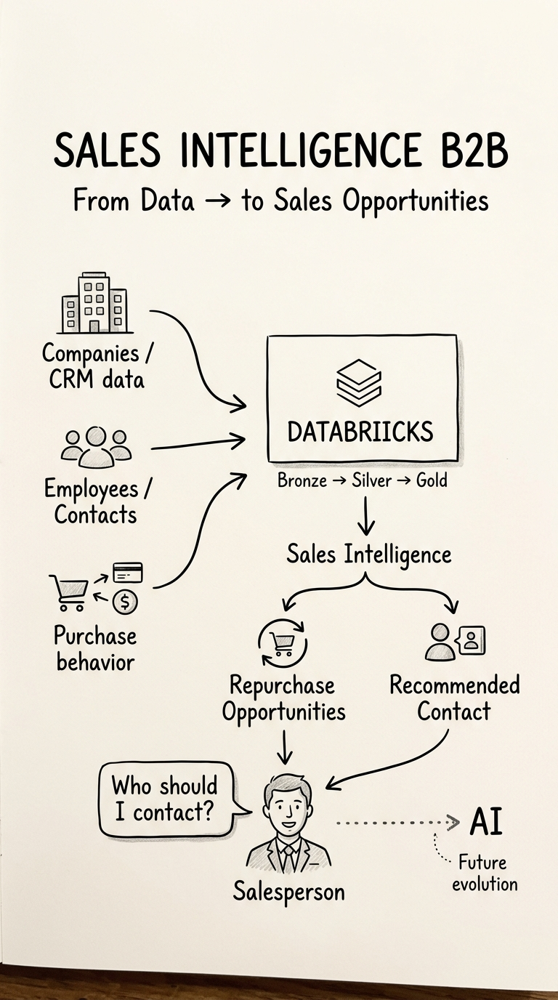

# B2B Sales Intelligence

Pipeline analítica de dados para priorização comercial B2B, identificação de oportunidades de recompra e recomendação de contatos decisores.

> Projeto de portfólio desenvolvido com Databricks Declarative Automation Bundles (DABs), arquitetura medalhão e execução automatizada por CLI.

---

## Visão geral

Equipes comerciais B2B normalmente possuem muitas empresas, contratos e contatos, mas recursos limitados para realizar abordagens personalizadas.

O **B2B Sales Intelligence** transforma dados de empresas e funcionários em informações acionáveis para responder perguntas como:

- Quais empresas devem ser priorizadas pelo time comercial?
- Quais clientes apresentam maior potencial de recompra?
- Quais empresas estão sem contato recente?
- Quem são os melhores contatos para uma abordagem comercial?
- Quais fatores justificam a prioridade de cada empresa?

A solução será construída em camadas **Bronze, Silver e Gold**, com regras de negócio explicáveis e rastreabilidade dos dados de origem.

---

## Objetivo do projeto

Construir um MVP de engenharia e análise de dados que:

1. ingira dados de empresas e funcionários;
2. preserve os dados originais em tabelas Bronze;
3. limpe, padronize e relacione os dados na camada Silver;
4. gere oportunidades comerciais na camada Gold;
5. recomende contatos comerciais relevantes;
6. calcule um score de prioridade explicável;
7. disponibilize os resultados para análises e consumo futuro.

---

## Dados utilizados

O projeto utiliza um dataset sintético de CRM e marketing B2B.

Arquivos principais:

```text
fixtures/
├── companies_clean.csv
└── employees_clean.csv
```

Arquivos previstos para etapas futuras de qualidade:

```text
companies_noisy.csv
employees_noisy.csv
employees_with_company_sample.csv
```

### Entidades principais

| Entidade | Arquivo | Chave |
|---|---|---|
| Empresas | `companies_clean.csv` | `Company_ID` |
| Funcionários | `employees_clean.csv` | `Employee_ID` |
| Relacionamento empresa-contato | Ambos | `Company_ID` |

O relacionamento entre empresas e funcionários é realizado por:

```text
employees_clean.Company_ID = companies_clean.Company_ID
```

Os dados são sintéticos e não representam clientes reais.

---

## Arquitetura

```text
CSV files
   │
   ▼
Bronze
Dados brutos com rastreabilidade
   │
   ▼
Silver
Dados limpos, tipados e relacionados
   │
   ▼
Gold
Oportunidades e contatos recomendados
   │
   ▼
Análises comerciais
```

### Camada Bronze

Responsável pela ingestão dos arquivos de origem sem perda dos dados originais.

Tabelas previstas:

```text
bronze_companies
bronze_employees
```

Colunas técnicas adicionadas:

```text
_ingestion_timestamp
_source_file
_source_system
```

### Camada Silver

Responsável pela limpeza e padronização dos dados.

Processos previstos:

- padronização dos nomes das colunas;
- conversão de tipos numéricos;
- conversão de datas;
- tratamento de entidades HTML, como `&`;
- remoção de duplicidades;
- validação das chaves;
- validação do relacionamento entre empresas e funcionários;
- criação da visão consolidada de empresas e contatos.

Tabelas previstas:

```text
silver_companies
silver_employees
silver_company_contacts
```

### Camada Gold

Responsável por transformar os dados tratados em produtos analíticos para o negócio.

Tabelas previstas:

```text
gold_company_opportunities
gold_recommended_contacts
```

#### `gold_company_opportunities`

Deverá apresentar, por empresa:

- informações cadastrais;
- status do contrato;
- frequência de compra;
- recência da última compra;
- volume de compras;
- indicadores de marketing;
- existência de decisores;
- score de prioridade;
- nível de prioridade;
- recomendação de ação comercial.

#### `gold_recommended_contacts`

Deverá apresentar os contatos mais relevantes para abordagem comercial, considerando fatores como:

- empresa relacionada;
- papel ou cargo;
- classificação como decisor;
- influência;
- completude dos dados;
- prioridade da empresa.

---

## Score de prioridade

O MVP utilizará um score heurístico, transparente e explicável.

O score poderá considerar:

- frequência de compra;
- dias desde a última compra;
- volume de compras no último ano;
- status do contrato;
- leads gerados;
- taxa de conversão;
- existência de decisores;
- influência dos contatos;
- necessidade de follow-up.

Os pesos e as regras serão documentados no projeto e validados com base na distribuição real dos dados.

> O MVP não utilizará machine learning. A prioridade será calculada por regras de negócio reproduzíveis.

---

## Tecnologias

- Databricks Free Edition;
- Databricks Declarative Automation Bundles;
- Databricks CLI;
- Python;
- PySpark;
- Delta Lake;
- Lakeflow Declarative Pipelines;
- Serverless Compute;
- Git e GitHub;
- Claude Code / Databricks AI Dev Kit;
- `pytest`;
- `ruff`;
- `uv`.

---

## Estrutura do projeto

```text
b2b_sales_intelligence/
├── .claude/                         # Configurações locais do agente
├── .llm/
│   └── prd.md                       # Requisitos do produto
├── fixtures/                        # Dados de entrada e arquivos de teste
│   ├── companies_clean.csv
│   └── employees_clean.csv
├── prompts/                         # Prompts versionados de implementação
│   ├── README.md
│   ├── 00-setup.md
│   ├── 01-bronze.md
│   ├── 02-silver.md
│   ├── 03-gold.md
│   ├── 04-scoring.md
│   └── 05-validation.md
├── resources/                       # Recursos Databricks declarados em YAML
├── src/                             # Código executado no Databricks
├── tests/                           # Testes automatizados
├── AGENTS.md                        # Instruções gerais para agentes de IA
├── CLAUDE.md                        # Instruções específicas para o Claude
├── databricks.yml                   # Configuração principal do bundle
├── pyproject.toml                   # Configuração do projeto Python
├── .gitignore
└── README.md
```

---

## Metodologia de desenvolvimento com IA

O projeto utiliza uma abordagem orientada por documentação e prompts versionados.

Antes de alterar o código, o agente deve consultar:

```text
.llm/prd.md
AGENTS.md
CLAUDE.md
prompts/<etapa-atual>.md
```

A implementação será realizada em etapas:

| Etapa | Entrega |
|---|---|
| `00-setup` | Preparação do bundle e remoção dos exemplos do template |
| `01-bronze` | Ingestão dos arquivos de empresas e funcionários |
| `02-silver` | Limpeza, tipagem, deduplicação e relacionamento |
| `03-gold` | Tabelas analíticas de oportunidades e contatos |
| `04-scoring` | Score de prioridade e recomendações comerciais |
| `05-validation` | Testes de qualidade, contagens e validação final |

Cada etapa deverá:

1. explicar o plano de implementação;
2. listar os arquivos que serão alterados;
3. executar somente o escopo aprovado;
4. validar o resultado;
5. documentar as decisões;
6. gerar um commit próprio.

---

## Ambiente Databricks

O bundle utiliza o catálogo:

```text
workspace
```

Os targets configurados são:

```text
dev
prod
```

Durante o desenvolvimento, os recursos serão publicados no target `dev`.

Comandos principais:

```bash
databricks bundle validate --profile grid_intelligence
databricks bundle deploy --profile grid_intelligence --target dev
databricks bundle run --profile grid_intelligence --target dev
```

O target de produção só deverá ser utilizado após a validação completa do MVP.

---

## Desenvolvimento local

### Pré-requisitos

- Git;
- Python compatível com o projeto;
- Databricks CLI;
- `uv`;
- acesso ao workspace Databricks;
- Claude Code ou agente compatível com o Databricks AI Dev Kit.

### Instalar dependências

Na raiz do projeto:

```bash
uv sync --dev
```

### Executar testes

```bash
uv run pytest
```

### Verificar estilo do código

```bash
uv run ruff check .
```

### Validar o bundle

```bash
databricks bundle validate --profile grid_intelligence
```

---

## Deploy

### Desenvolvimento

```bash
databricks bundle deploy \
  --profile grid_intelligence \
  --target dev
```

### Produção

O deploy em produção será realizado somente após a validação do MVP:

```bash
databricks bundle deploy \
  --profile grid_intelligence \
  --target prod
```

---

## Critérios de aceite

O projeto será considerado funcional quando:

- o bundle passar no `databricks bundle validate`;
- os arquivos de empresas e funcionários forem ingeridos;
- as tabelas Bronze forem criadas;
- os tipos de dados forem padronizados;
- as duplicidades forem tratadas;
- o relacionamento entre empresas e funcionários for validado;
- as tabelas Silver forem criadas;
- as tabelas Gold forem criadas;
- o score de prioridade for calculado;
- os contatos recomendados forem identificados;
- os testes de qualidade forem executados;
- o pipeline puder ser reproduzido por CLI;
- a documentação estiver atualizada.

---

## Status atual

**Etapa 00 (setup) concluída — Bronze, Silver e Gold serão implementadas nas próximas etapas.**

Concluído:

- bundle Databricks criado;
- autenticação da CLI configurada;
- target `dev` validado;
- dataset adicionado à pasta `fixtures`;
- estrutura inicial de documentação criada;
- PRD em preparação;
- prompts de implementação em preparação;
- exemplos de táxi do template removidos;
- job ajustado para executar somente a pipeline ETL;
- estrutura do bundle preparada para as próximas etapas.

Próximas etapas:

1. implementar a camada Bronze (ingestão dos CSVs de `fixtures/`);
2. validar a ingestão;
3. implementar Silver e Gold;
4. implementar o score de prioridade e as recomendações;
5. executar a validação final.

---

## Licença e origem dos dados

Este projeto é destinado a fins educacionais e de portfólio.

Os dados utilizados são sintéticos. A licença e a referência original do dataset devem ser mantidas conforme as condições de distribuição da fonte utilizada.